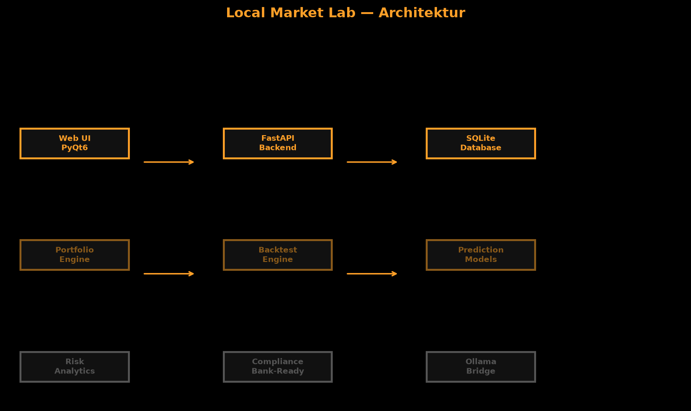
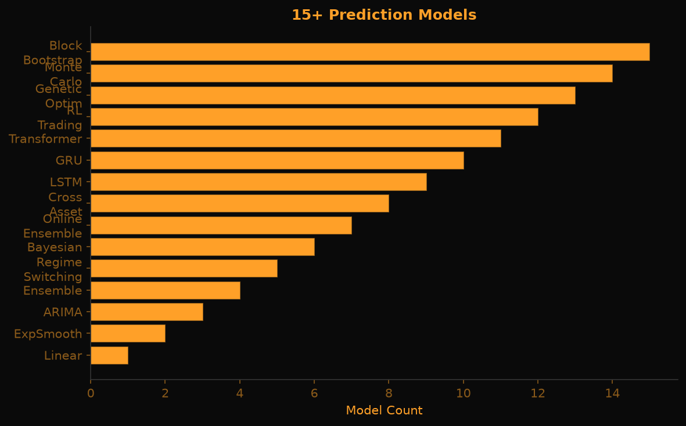
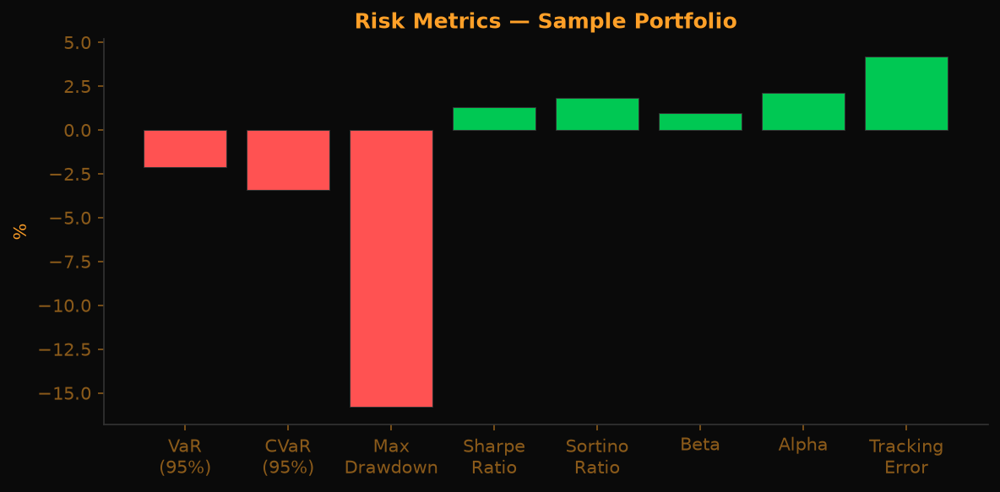

# Local Market Lab — Technische Dokumentation v0.9.0

> **Fortschrittsorientierte Marktanalyse auf deinem eigenen Rechner.**
> Keine Cloud. Keine Datenweitergabe. Keine Signale. Keine Beratung.

---

## Inhaltsverzeichnis

1. [Einleitung & Mission](#1-einleitung--mission)
2. [Architektur-Übersicht](#2-architektur-übersicht)
3. [Schnellstart](#3-schnellstart)
4. [API-Referenz](#4-api-referenz)
5. [Portfolio-Engine](#5-portfolio-engine)
6. [Backtest-Engine](#6-backtest-engine)
7. [Szenarien-Engine](#7-szenarien-engine)
8. [Trading-Game](#8-trading-game)
9. [KI-Prediction](#9-ki-prediction)
10. [Risk-Analytics](#10-risk-analytics)
11. [Bank-Ready & Compliance](#11-bank-ready--compliance)
12. [Windows-App](#12-windows-app)
13. [Ollama-Integration](#13-ollama-integration)
14. [Validierung & Optimierung](#14-validierung--optimierung)
15. [Stress-Tests & Krisenszenarien](#15-stress-tests--krisenszenarien)
16. [Rebalancing-Assistent](#16-rebalancing-assistent)
17. [Export & Berichte](#17-export--berichte)
18. [Erklärbarkeit](#18-erklärbarkeit)
19. [Datenqualitätsprüfung](#19-datenqualitätsprüfung)
20. [Marktdaten-Adapter](#20-marktdaten-adapter)
21. [Sicherheit & Compliance](#21-sicherheit--compliance)
22. [Konfiguration](#22-konfiguration)
23. [FAQ](#23-faq)
24. [Troubleshooting](#24-troubleshooting)

---

## 1. Einleitung & Mission

**Local Market Lab** ist eine lokal arbeitende, datenschutzorientierte Workbench für:

- **Portfolioanalyse** — Bewertung, P&L, Allokation
- **Backtesting** — Strategien testen mit Gebühren, Slippage, Benchmarks
- **Szenariosimulation** — Monte-Carlo, Block-Bootstrap, historische Replay
- **Trading-Spiel** — Paper-Trading mit virtuellen Kapital und Rangliste
- **KI-Prediction** — 15+ Modelle, lokal, ohne Cloud-Abhängigkeit
- **Risikoanalyse** — VaR, CVaR, Korrelation, Rolling-Metriken

**Mission**: Institutionelle Methodik privaten Nutzern zur Verfügung stellen, ohne Kompromisse bei Datenschutz und Reproduzierbarkeit.

**Design-Prinzipien**:

| Prinzip | Umsetzung |
|---------|-----------|
| **Lokal** | Alles läuft lokal. Keine Cloud erforderlich. |
| **Privacy** | Keine Telemetrie, keine Abhängigkeit von externen Services |
| **Reproduzierbarkeit** | Jede Berechnung hat Seed, Timestamp, Data-Hash |
| **Transparenz** | Alle Methoden dokumentiert, keine Black-Box-Modelle |
| **Decimal-Only** | Keine Floats für Geldbeträge, `ROUND_HALF_UP` |
| **Determinismus** | Gleiche Inputs → gleiche Outputs |

---

## 2. Architektur-Übersicht



### 2.1 Schichten

| Schicht | Technologie | Aufgabe |
|---------|-------------|---------|
| **Web UI** | FastAPI + HTML/Canvas | Bloomberg-Terminal-Oberfläche im Browser |
| **Windows App** | PyQt6 + pyqtgraph | Native Desktop-Anwendung mit Echtzeit-Charts |
| **API Backend** | FastAPI | REST + WebSocket, Port 8322 |
| **Datenbank** | SQLite | Append-only wo relevant, pro User isoliert |
| **Python-Packages** | numpy, requests, sqlite3 | Berechnungen ohne externe Abhängigkeiten |

### 2.2 Modulstruktur

```
local-market-lab/
├── apps/
│   ├── api/           # FastAPI REST- und WebSocket-Server
│   ├── cli/           # Typer-Kommandozeilen-Tool
│   ├── web/           # HTML/CSS/Canvas Terminal-UI
│   ├── mcp/           # Model Context Protocol Server
│   └── gui/           # PyQt6 Desktop-App (Windows)
├── packages/
│   ├── core/          # Money, Dates, Hashing
│   ├── domain/        # Entitäten (Instrument, Transaction, ...)
│   ├── storage/       # SQLite-Workspace, State-Singletons
│   ├── ingest/        # CSV-Import, Demo-Daten
│   ├── marketdata/    # Preisreihen, FX, Adapter
│   ├── portfolio/     # Position Engine, Valuation
│   ├── metrics/       # CAGR, Sharpe, Sortino, VaR, CVaR
│   ├── backtest/      # Event-Loop, Strategien
│   ├── scenarios/     # Monte-Carlo, Bootstrap, Prediction
│   ├── artifacts/     # Reproduzierbarkeits-Manifeste
│   ├── compliance/    # Guard, Audit, Bank-Ready
│   ├── reports/       # Markdown-Berichte
│   ├── game/          # Trading-Spiel, Multiplayer-Lobby
│   └── ollama/        # Lokale LLM-Bridge
├── tests/             # 90+ pytest-Tests
└── docs/              # Dokumentation und Grafiken
```

---

## 3. Schnellstart

### 3.1 Installation

```bash
# Repo klonen
git clone https://github.com/mrmixx-max/local-market-lab.git
cd local-market-lab

# Python 3.10+ erforderlich
python --version

# Dependencies installieren
pip install -e ".[dev]"
```

### 3.2 Erster Start (Web UI)

```bash
# API-Server starten
python -m apps.api

# Browser öffnen
start http://127.0.0.1:8322/
```

### 3.3 Erster Start (Windows-App)

```bash
# Build-Script ausführen
cd windows/src && python build.spec

# Oder direkt starten
python -m windows.src.app
```

### 3.4 Installation Windows-Installer

`LocalMarketLab-Setup-v0.8.0.exe` aus dem Release herunterladen, ausführen, folgen.

---

## 4. API-Referenz

### 4.1 Gesundheitsprüfung

```
GET /api/v1/health
```

Antwort:
```json
{
  "status": "ok",
  "instruments": 4,
  "version": "0.8.0",
  "db_connected": true,
  "uptime_seconds": 42.5
}
```

### 4.2 Marktdaten

```
GET /api/v1/market/symbols
GET /api/v1/market/prices/{symbol}
```

### 4.3 Portfolio

```
GET /api/v1/portfolio/{name}?benchmark=IWDA&include_analytics=true
```

### 4.4 Backtest

```
POST /api/v1/backtest
```

```json
{
  "portfolio": {
    "IWDA": 0.6,
    "EIMI": 0.4
  },
  "strategy": "buy_and_hold",
  "fees_bps": 5,
  "slippage_bps": 2
}
```

### 4.5 Szenario

```
POST /api/v1/scenario
```

```json
{
  "symbols": ["IWDA", "EIMI", "AGGH"],
  "method": "monte_carlo",
  "n_simulations": 10000,
  "horizon_days": 252,
  "initial_value": 100000,
  "seed": 42
}
```

### 4.6 KI-Prediction

```
POST /api/v1/scenario/forecast/{symbol}
```

```json
{
  "horizon": 30,
  "method": "ensemble"
}
```

### 4.7 Trading-Game

```
POST /api/v1/game/create
POST /api/v1/game/{game_id}/order
POST /api/v1/game/{game_id}/tick
GET /api/v1/game/{game_id}/state
GET /api/v1/game/leaderboard
```

### 4.8 Kompliance

```
GET /api/v1/compliance/audit-log
POST /api/v1/compliance/integrity-check
GET /api/v1/compliance/report
```

---

## 5. Portfolio-Engine

### 5.1 Bewertung

Die Portfolio-Engine nutzt ausschließlich `Decimal`-Werte für Geldbeträge. Float-Eingaben werden beim Parsing abgelehnt.

**FX-Policy**: Fehlende Wechselkurse erzeugen einen `incomplete`-State — niemals stille 1:1-Konvertierung.

### 5.2 Corporate Actions

- **Splits**: Automatische Anpassung der Stückzahl
- **Dividenden**: Cash-Dividenden als separate Transaktion
- **Chronologische Reihenfolge**: Alle Aktionen werden in Reihenfolge verarbeitet

### 5.3 Allokation

```
GET /api/v1/portfolio/{name}?include_analytics=true
```

Liefert `allocation` nach `asset_class` aus der instruments-Tabelle.

---

## 6. Backtest-Engine

### 6.1 Verfügbare Strategien

| Strategie | Beschreibung |
|-----------|-------------|
| `buy_and_hold` | Einmal kaufen, nicht verkaufen |
| `periodic_rebalance_63` | Alle 63 Tage (Quartal) ausbalancieren |
| `momentum_20` | 20-Tage-Momentum, Top-Asset kaufen |
| `mean_reversion_20` | 20-Tage-Mean-Reversion |

### 6.2 Metriken

- **CAGR**: Compounded Annual Growth Rate (252 Tage annualisiert)
- **Max Drawdown**: Maximaler Verlust vom Peak
- **Sharpe Ratio**: Risikoadjustierte Rendite (Rf=0)
- **Sortino Ratio**: Wie Sharpe, aber nur Downside-Volatilität
- **Calmar Ratio**: CAGR / Max Drawdown

---

## 7. Szenarien-Engine

### 7.1 Methoden

| Methode | Seed | Beschreibung |
|---------|------|-------------|
| Monte-Carlo | ja | iid Normal-Returns |
| Block-Bootstrap | ja | Zufallsblöcke aus historischen Returns |
| Historical-Replay | ja | Ein historisches Jahr verwenden |

### 7.2 Ausgabe

Alle Methoden liefern:
- Perzentile (P05, P25, P50, P75, P95)
- Verlustwahrscheinlichkeit
- Disclaimer: Keine Prognose, nur Szenario

---

## 8. Trading-Game

### 8.1 Challenges

| Challenge | Ziel |
|-----------|------|
| `beat_market` | Benchmark (IWDA) schlagen |
| `low_volatility` | Max. Volatilität < 10% |
| `income_generator` | Monatliche Dividenden |
| `max_sharpe` | Max. Sharpe Ratio |
| `min_volatility` | Min. Portefeuille-Volatilität |
| `beat_benchmark_by_5pct` | 5% über Benchmark |

### 8.2 Leaderboard

Endgame-Summary pro Spiel:
- Total Return, CAGR, Max Drawdown, Sharpe, Sortino
- Anzahl Trades, Win Rate
- Equity-Curve für Vergleich

---

## 9. KI-Prediction

### 9.1 15+ Modelle



| Kategorie | Modelle |
|-----------|---------|
| **Basismodelle** | Linear Trend, Holt's ExpSmooth, ARIMA-like, Ensemble |
| **Fortgeschritten** | Regime-Switching, Bayesian Trend/Seasonal, Online Ensemble, Cross-Asset |
| **Deep Learning** | LSTM, GRU (BPTT, Adam, Gradient Clipping) |
| **Reinforcement Learning** | Q-Learning, DQN, REINFORCE |
| **Genetische Optimierung** | Feature-Selection, Differential Evolution, NSGA-II |
| **Szenarien** | Monte-Carlo, Block-Bootstrap, Historical-Replay |

### 9.2 Ensemble

`ensemble_forecast()` kombiniert drei Basismodelle und gewichtet nach inverser Varianz.

### 9.3 Konfidenzintervalle

Alle Modelle liefern 68% und 95% Credible/Confidence Intervals.

---

## 10. Risk-Analytics



### 10.1 Metriken

- **VaR (95%)**: Value at Risk, historische Simulation
- **CVaR (95%)**: Expected Shortfall
- **Rolling Sharpe**: 63-Tage rollierend
- **Drawdown Series**: Drawdown als Zeitreihe
- **Performance Attribution**: Pro-Position-Rendite-Beitrag
- **Korrelationsmatrix**: Pearson-Korrelation zwischen Positionen

---

## 11. Bank-Ready & Compliance

### 11.1 Audit-Logger

Append-only Log aller API-Aktionen:
- User, Timestamp, Action, Params, Result-Hash
- SHA-256-Prüfsummen pro Tabellen-Snapshot

### 11.2 Data Integrity

Automatische Checksummen für `instruments`, `transactions`, `prices`, `corporate_actions`.

### 11.3 Compliance-Report (BaFin-Style)

```json
{
  "system_version": "0.9.0",
  "audit_log_summary": {...},
  "data_integrity_status": "valid",
  "user_actions_count": 42,
  "risk_flags": []
}
```

### 11.4 GDPR-Export & -Löschung

- `GET /api/v1/compliance/export/{user}` — JSON-Export
- `POST /api/v1/compliance/delete-account` — Anonymisierung

---

## 12. Windows-App

### 12.1 Installation

1. `LocalMarketLab-Setup-v0.8.0.exe` herunterladen
2. Installer ausführen
- Desktop-Verknüpfung optional
3. App starten

### 12.2 Features

- **10 Tabs**: Markets, Backtest, Scenarios, Validation, Explainability, Rebalancing, Export, Risk, Ollama, Game
- **Sidebar**: Watchlist mit Live-Updates (320px breit)
- **Top-Bar**: Branding, Uhr, Verbindungsstatus
- **Statusbar**: Disclaimer
- **Charts**: Candlestick, Line, Histogram, Drawdown (pyqtgraph)
- **Live-Ticks**: WebSocket-Updates im Watchlist
- **Schrift**: 16px Basisgröße für bessere Lesbarkeit
- **Theme**: Dunkles Farbschema (Dark Theme)

### 12.3 Tab-Übersicht

| Tab | Inhalt |
|-----|--------|
| **Marktsuche** | Preise, Kurse, historische Daten |
| **Backtest** | Strategien testen, Performance-Analyse |
| **Szenarien** | Monte-Carlo, Bootstrap, historische Replay |
| **Validierung** | Walk-Forward, Zeit-Kreuzvalidierung, Hyperparameter |
| **Erklärbarkeit** | Feature-Wichtigkeit, SHAP-ähnlich, Diebold-Mariano |
| **Rebalancing** | Ausgleichsvorschläge, keine automatische Ausführung |
| **Export** | PDF-, Excel-, CSV-Berichte |
| **Risiko** | Value at Risk, CVaR, Korrelation |
| **Ollama** | Lokale LLM-Chat-Oberfläche |
| **Spiel** | Paper-Trading mit virtuellem Kapital |

### 12.4 Architektur

`QMainWindow` → `QTabWidget` + `QSplitter` → Chart-/Dashboard-Widgets

Splash-Screen → Health-Check API → Fallback auf lokale SQLite

---

## 13. Ollama-Integration

### 13.1 Vorbereitung

Ollama installieren und starten:
```bash
ollama serve
ollama pull gemma4:latest
```

### 13.2 API

```
GET /api/v1/ollama/models
POST /api/v1/ollama/chat
POST /api/v1/ollama/generate
```

### 13.3 Prompt-Optimizer

Der Chat-Tab enthält einen eingebauten Prompt-Optimizer mit 5 Tips für bessere Trading-Prompts.

---

## 14. Konfiguration

### 14.1 Umgebungsvariablen

| Variable | Default | Beschreibung |
|----------|---------|-------------|
| `LML_HOST` | `127.0.0.1` | API-Server Host |
| `LML_PORT` | `8322` | API-Server Port |
| `LML_DB` | `./data/marketlab.db` | SQLite-Pfad |
| `OLLAMA_HOST` | `http://localhost:11434` | Ollama-Server |
| `LML_CORS_ORIGINS` | `*` | CORS-Origins (kommagetrennt) |

### 14.2 Demo-Daten

```bash
lml demo
```

Lädt synthetische Preise (IWDA, EIMI, AGGH, BTC) und ein Demo-Portfolio.

---

## 15. FAQ

**F: Warum keine echten Marktdaten?**
A: Datenschutz. Echte Daten erfordern API-Keys und senden Abfragen an externe Server. LML funktioniert komplett offline.

**F: Kann ich meine eigenen CSV-Dateien importieren?**
A: Ja, mit `lml import txn` und `lml import prices`.

**F: Ist das Finanzberatung?**
A: Nein. LML ist ausschließlich Forschungs- und Bildungsinvestment. Keine Kauf-/Verkaufsempfehlungen.

**F: Warum Python und nicht C++/Rust?**
A: Lesbarkeit, Reproduzierbarkeit, einfache Installation. Performance ist für die meisten Anwendungsfälle ausreichend.

**F: Funktioniert das auf macOS/Linux?**
A: Ja, die Web-UI und CLI funktionieren plattformunabhängig. Die Windows-App ist Windows-spezifisch.

---

## 16. Troubleshooting

| Problem | Lösung |
|---------|--------|
| `429 Too Many Requests` | Rate Limiter aktiv — 100 Anfragen/Minute/IP |
| `incomplete` bei FX | Fehlender Wechselkurs — manuell importieren oder Währung vermeiden |
| `Circular Import` | `state.py` verwenden, nicht direkt `workspace.py` |
| `game_id not found` | Singleton-Problem — API-Server neu starten |
| App startet nicht | API-Server prüfen: `curl http://127.0.0.1:8322/api/v1/health` |

---

## 14. Validierung & Optimierung

### 14.1 Walk-Forward-Validation

Die Walk-Forward-Validation simuliert die reale Anwendung: Das Modell wird auf einem Fenster trainiert und auf dem nächsten getestet. Der Fenster-Verschiebungsschritt wiederholt sich über die gesamte Datenreihe.

```
POST /api/v1/validation/walk-forward
```

```json
{
  "symbol": "IWDA",
  "source": "yahoo",
  "train_window": 252,
  "test_window": 63,
  "step": 21,
  "seed": 42
}
```

**Parameter**:
| Parameter | Beschreibung |
|-----------|-------------|
| `symbol` | Börsensymbol |
| `source` | Datenquelle (`yahoo`, `alphavantage`) |
| `train_window` | Trainingsfenster in Handelstagen |
| `test_window` | Testfenster in Handelstagen |
| `step` | Verschiebungsschritt in Handelstagen |
| `seed` | Reproduzierbarkeits-Startwert |

**Ausgabe**: Liste der Fenster-Ergebnisse mit Trainings-/Test-Perioden und Metriken pro Fenster.

### 14.2 Zeit-Kreuzvalidierung (Time-Series CV)

Zeit-Kreuzvalidierung teilt die Zeitreihe in `n_splits` disjunkte Test-Sets auf, wobei eine Lücke (`gap`) zwischen Training und Test verhindert, dass zukünftige Daten in das Training einfließen.

```
POST /api/v1/validation/cv
```

```json
{
  "symbol": "IWDA",
  "source": "yahoo",
  "n_splits": 5,
  "gap": 5,
  "metric": "sharpe",
  "seed": 42
}
```

**Parameter**:
| Parameter | Beschreibung |
|-----------|-------------|
| `n_splits` | Anzahl der Validierungsteilungen |
| `gap` | Lücke zwischen Training und Test (Tage) |
| `metric` | Bewertungsmetrik (`sharpe`, `sortino`, `cagr`) |

### 14.3 Hyperparameter-Optimierung

Automatische Suche nach optimalen Strategie-Parametern mit konfigurierbaren Suchverfahren.

```
POST /api/v1/validation/hyperparameter
```

```json
{
  "symbol": "IWDA",
  "source": "yahoo",
  "param_grid": {
    "window": [10, 20, 50],
    "threshold": [0.01, 0.02, 0.05]
  },
  "metric": "sharpe",
  "n_trials": 50,
  "method": "grid",
  "seed": 42
}
```

**Methoden**:
| Methode | Beschreibung |
|---------|-------------|
| `grid` | Vollständige Rastersuche über `param_grid` |
| `random` | Zufällige Stichprobe aus `param_grid` |
| `bayesian` | Bayes-Optimierung mit Surrogat-Modell |

---

## 15. Stress-Tests & Krisenszenarien

### 15.1 Stress-Tests

Simuliert Portfolio-Verluste unter extremen Marktbedingungen.

```
POST /api/v1/scenario/stress
```

```json
{
  "scenario": "crash_30",
  "positions": {
    "IWDA": 0.6,
    "AGGH": 0.4
  },
  "seed": 42
}
```

**Verfügbare Szenarien**:
| Szenario | Beschreibung |
|----------|-------------|
| `crash_30` | Sofortiger Kurssturz um 30% |
| `crash_50` | Sofortiger Kurssturz um 50% |
| `vol_spike` | Verdopplung der Volatilität |
| `correlation_break` | Korrelation geht auf 1.0 |
| `liquidity_crisis` | Ausgehandelte Märkte, hohe Slippage |

### 15.2 Krisenszenarien

Historische Krisen nachstellen und auf aktuelle Portfolios anwenden.

```
POST /api/v1/scenario/crisis
```

```json
{
  "crisis_type": "2008",
  "positions": {
    "IWDA": 0.6,
    "EIMI": 0.4
  },
  "params": {},
  "seed": 42
}
```

**Verfügbare Krisen**:
| Krisen-Typ | Zeitraum | Beschreibung |
|------------|----------|-------------|
| `2008` | 2008-2009 | Finanzkrise (Subprime) |
| `2020` | 2020 | COVID-19-Pandemie |
| `2022` | 2022 | Zinswende, Inflationskrise |
| `dotcom` | 2000-2002 | Dotcom-Blase |

**Ausgabe**: Verlustbetrag, prozentuale Verluste, Erholungszeit, Vergleich mit Benchmark.

---

## 16. Rebalancing-Assistent

### 16.1 Funktionsweise

Der Rebalancing-Assistent analysiert das Portfolio und schlägt Ausgleichsmaßnahmen vor. **Keine automatische Ausführung** — alle Vorschläge müssen manuell bestätigt werden.

```
GET /api/v1/portfolio/{name}/rebalancing
```

### 16.2 Vorschlags-Logik

| Schritt | Beschreibung |
|---------|-------------|
| 1. Ist-Zustand | Aktuelle Gewichte berechnen |
| 2. Soll-Zustand | Zielgewichte aus Strategie laden |
| 3. Abweichung | Differenz Ist vs. Soll |
| 4. Schwellenwert | Nur vorschlagen wenn Abweichung > Schwellenwert |
| 5. Handelsvorschlag | Kauf-/Verkaufs-Mengen berechnen |

### 16.3 Ausgabe

```json
{
  "portfolio": "MeinPortfolio",
  "drift_threshold": 0.05,
  "rebalancing_needed": true,
  "suggestions": [
    {
      "symbol": "IWDA",
      "current_weight": 0.65,
      "target_weight": 0.60,
      "action": "Verkauf",
      "amount": 500.00
    }
  ]
}
```

---

## 17. Export & Berichte

### 17.1 PDF-Export

Erstellt professionelle PDF-Berichte mit Charts und Tabellen.

```
POST /api/v1/export/pdf
```

```json
{
  "portfolio": "MeinPortfolio",
  "include_charts": true,
  "include_metrics": true,
  "title": "Portfolio-Bericht Q3 2026"
}
```

### 17.2 Excel-Export

Exportiert Rohdaten und Berechnungen für eigene Analysen.

```
POST /api/v1/export/excel
```

```json
{
  "portfolio": "MeinPortfolio",
  "sheets": ["positions", "transactions", "metrics", "prices"]
}
```

**Verfügbare Blätter**: `positions`, `transactions`, `metrics`, `prices`, `allocation`, `risk`

### 17.3 CSV-Export

Maschinenlesbare Ausgabe für Datenpipelines.

```
POST /api/v1/export/csv
```

```json
{
  "portfolio": "MeinPortfolio",
  "data_type": "prices",
  "date_from": "2024-01-01",
  "date_to": "2026-08-24"
}
```

---

## 18. Erklärbarkeit

### 18.1 Feature-Wichtigkeit

Welche Merkmale beeinflussen die Vorhersage am stärksten?

```
GET /api/v1/explainability/importance?symbol=IWDA&model=ensemble
```

**Ausgabe**:
```json
{
  "symbol": "IWDA",
  "model": "ensemble",
  "importance": [
    {"feature": "momentum_20", "importance": 0.35},
    {"feature": "volatility_20", "importance": 0.25},
    {"feature": "volume_change", "importance": 0.15}
  ]
}
```

### 18.2 SHAP-ähnliche Erklärung

Lokale Erklärungen für einzelne Vorhersagen — ähnlich SHAP-Werten, berechnet über Permutation.

```
GET /api/v1/explainability/explain?symbol=IWDA&date=2026-08-24
```

### 18.3 Modellvergleich (Diebold-Mariano)

Statistischer Test, ob ein Modell ein anderes signifikant übertrifft.

```
GET /api/v1/explainability/compare?symbol=IWDA&model_a=linear&model_b=ensemble&metric=mse
```

**Ausgabe**:
```json
{
  "test": "Diebold-Mariano",
  "statistic": -2.15,
  "p_value": 0.032,
  "significant": true,
  "better_model": "ensemble"
}
```

---

## 19. Datenqualitätsprüfung

### 19.1 Qualitätsbericht

Automatische Prüfung der Vollständigkeit, Konsistenz und Aktualität der Daten.

```
GET /api/v1/quality/report/{symbol}
```

**Ausgabe**:
```json
{
  "symbol": "IWDA",
  "quality_score": 0.95,
  "checks": {
    "completeness": 0.98,
    "consistency": 0.96,
    "timeliness": 0.91,
    "outliers": 0.99
  },
  "issues": [
    {
      "type": "missing_data",
      "date": "2024-03-15",
      "severity": "low"
    }
  ]
}
```

### 19.2 Qualitätskriterien

| Kriterium | Beschreibung | Schwellenwert |
|-----------|-------------|---------------|
| **Vollständigkeit** | Fehlende Datenpunkte | > 95% |
| **Konsistenz** | Plötzliche Sprünge, Ausreißer | < 3 Standardabweichungen |
| **Aktualität** | Letzter Datenpunkt nicht älter als... | < 5 Handelstage |
| **Kontinuität** | Keine Lücken > 5 Tage | 0 Lücken |

### 19.3 Automatische Reparatur

- **Fehlende Werte**: Lineare Interpolation (max. 3 Tage)
- **Ausreißer**: Winsorization auf 1./99. Perzentil
- **Duplikate**: Automatische Entfernung, letzter Wert gewinnt

---

## 20. Marktdaten-Adapter

### 20.1 Yahoo Finance

Direkter Zugriff auf Yahoo Finance-Daten ohne API-Schlüssel.

```
GET /api/v1/market/data/{symbol}?source=yahoo
```

**Parameter**:
| Parameter | Beschreibung |
|-----------|-------------|
| `symbol` | Börsensymbol (z.B. `IWDA.AS`) |
| `source` | `yahoo` |
| `interval` | `1d`, `1wk`, `1mo` |
| `range` | `1mo`, `3mo`, `1y`, `5y`, `max` |

### 20.2 Alpha Vantage

Professionelle Datenquelle mit API-Schlüssel.

```
GET /api/v1/market/data/{symbol}?source=alphavantage&apikey=DEIN_KEY
```

**Konfiguration**:
```bash
export ALPHA_VANTAGE_KEY=dein_api_schluessel
```

### 20.3 Adapter-Vergleich

| Merkmal | Yahoo Finance | Alpha Vantage |
|---------|--------------|---------------|
| API-Schlüssel | Nein | Ja |
| Echtzeit | 15 Min. verzögert | Echtzeit |
| Historisch | 40+ Jahre | 20+ Jahre |
| Limits | Fair Use | 5 Anfragen/Min. |
| Währung | USD, EUR, GBP | USD |

---

## 21. Sicherheit & Compliance

### 21.1 CORS (Cross-Origin Resource Sharing)

Standardmäßig auf `127.0.0.1` beschränkt. Produktion:

```bash
export LML_CORS_ORIGINS="https://meine-domain.de,https://app.meine-domain.de"
```

### 21.2 Ratenbegrenzung (Rate Limiting)

Schutz vor Überlastung und Missbrauch:

| Limit | Wert |
|-------|------|
| Standard | 100 Anfragen/Minute/IP |
| Authentifizierte | 1000 Anfragen/Minute |
| Burst | 20 Anfragen/Sekunde |

**Antwort bei Überschreitung**:
```json
{
  "error": "rate_limit_exceeded",
  "retry_after": 30
}
```

### 21.3 Pfad-Traversal-Schutz

Alle Datei-Pfade werden normalisiert und validiert:

- Keine `..`-Sequenzen in Pfaden
- Keine absoluten Pfade außerhalb des Arbeitsbereichs
- Whitelist erlaubter Dateiendungen (`.csv`, `.json`, `.db`)
- Maximale Pfadlänge: 256 Zeichen

### 21.4 Eingabevalidierung

| Validierung | Umsetzung |
|-------------|-----------|
| SQL-Injection | Parametrisierte Queries, kein String-Concatenation |
| XSS | HTML-Escaping aller Ausgaben |
| JSON-Schema | Validierung aller POST-Bodies |
| Dateigrößen | Max. 10 MB Upload |

### 21.5 Audit-Logging

Alle sicherheitsrelevanten Ereignisse werden protokolliert:

- Authentifizierungsversuche (erfolgreich/fehlgeschlagen)
- Rate-Limit-Treffer
- Ungültige Pfad-Anfragen
- API-Fehler 4xx/5xx

---

*Lokale First. Keine Cloud. Keine Kompromisse.*

**Repository**: [github.com/mrmixx-max/local-market-lab](https://github.com/mrmixx-max/local-market-lab)
